#  Desafío de Calentamiento 9 - Maratón Behind the Code 2020

Se acerca el Desafío final de la Maratón Behind the Code 2020, y los 100 clasificados entre varios países latinoamericanos competirán por el premio final: un viaje a Israel para los cinco primeros. Las tecnologías y conceptos que se aplicarán en el Desafío 9 se centran en contenedores y DevOps, especialmente OpenShift, una alternativa empresarial a Kubernetes, con un enfoque en la seguridad y modularidad y construido por Red Hat. Al final de este tutorial, tendrá una noción básica de algunos conceptos básicos de herramientas, como: **Projects**, **Deployments**, **Services**, **Builds** y **Routes**: algunas de estas abstracciones de OpenShift son análogas a las de Kubernetes !

## Tutorial de OpenShift: deployment utilizando source-to-image (s2i)

### Sobre el tutorial

En este tutorial, aprenderá cómo acceder a un clúster de OpenShift disponible en IBM Cloud, también llamado Red Hat *OpenShift Kubernetes Service (ROKS)*. A partir de ahí, se demostrará cómo integrar un repositorio privado de GitHub con un proyecto en OpenShift a través de webhook. Este webhook se activa siempre que se aplica un cambio a la rama principal / maestra del repositorio, provocando la actualización automática de su aplicación que se ejecuta en el clúster sin tiempo de inactividad, es decir, sin ser interrumpida.

Este tutorial no es obligatorio, sin embargo, se recomienda que lo complete antes del día del desafío final, para prepararse y también asegurarse de que puede acceder al clúster disponible con normalidad.


### Acerca de la política para usar el clúster proporcionado

Devemos lembrá-lo(a) que o cluster fornecido somente poderá ser usado para o desafio. O uso indevido dessa infraestrutura poderá acarretar na sua desclassificação. É recomendável que você não deixe o projeto poluído com **Deployments** e outros objetos, pois esse será o único projeto ao qual você terá acesso, inclusive no dia do desafio -- <b>não delete ou renomeie o seu Project em hipótese alguma!</b>

Debemos recordarle que el clúster proporcionado solo se puede utilizar para el desafío. El uso inadecuado de esta infraestructura puede resultar en su descalificación. Se recomienda que no deje el proyecto contaminado con **Deployments** y otros objetos, ya que este será el único proyecto al que tendrá acceso, incluso el día del desafío - <b> no elimine ni cambie el nombre de su Project en ningún caso! </b>


### Requisitos para realizar el tutorial

1. Poseer una cuenta activa en <a href="https://cloud.ibm.com/registration">IBM Cloud</a>;

2. Haber completado el <a href=https://challenge9.maratona.dev/> formulario de configuración para el desafío </a>. Si no respondió el formulario antes del 2 de diciembre, lo más probable es que su acceso al clúster aún no se haya configurado. Por favor complete el formulario lo antes posible e informe a la organización.

3. Poseer una cuenta en <a href="https://github.com">GitHub</a> (instalar la herramienta *git* em su maquina es opcional);

### Desarrollo

#### Etapa 1 - Accediendo al Web console de ROKS:

Inicie sesión normalmente en su cuenta de IBM Cloud (la misma que informo en el formulario de configuración), haga clic en su nombre en la esquina superior derecha y seleccione la cuenta "1960796 - IBM PoC - Marathon Behind the Code", como se muestra en la siguiente imagen:

<div align="center" width="90%" style="border: 1px solid black;">
  
</div><br>

Después de eso, vaya a la <a href="https://cloud.ibm.com/resources"> lista de recursos en su cuenta de IBM Cloud </a>. Haga clic en el clúster **MBTC-2020-D9**, como se muestra en la imagen a continuación:

<div align="center" width="90%" style="border: 1px solid black;">
  
</div><br>

Después de acceder a la página del clúster instanciado en IBM Cloud, haga clic en el botón azul **"OpenShift web console"**, ubicado en la esquina superior derecha de la página.

<div align="center" width="90%" style="border: 1px solid black;">
  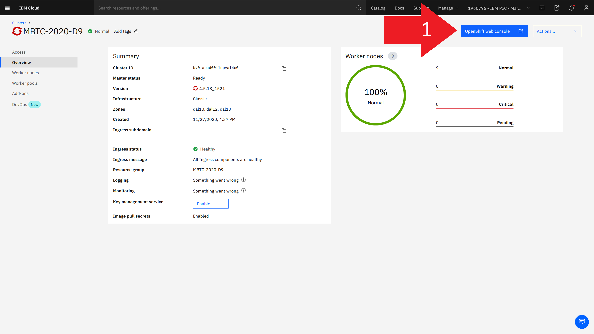
</div><br>

Espere a que se cargue la página. Es probable que su navegador bloquee la apertura de ventanas emergentes (pop-ups). Asegúrese de otorgar permisos para que se abra la consola web de OpenShift. En la siguiente imagen, se muestra la pantalla "Projects" de la vista Administrador de la consola web de OpenShift. A través de la consola web es posible administrar e implementar aplicaciones sin la necesidad de instalar la interfaz de línea de comandos de OpenShift, también conocida como *oc*.

<div align="center" width="90%" style="border: 1px solid black;">
  
</div><br>

Tendrá acceso de administrador a un solo proyecto, ya creado por la organización. En la imagen de arriba puede ver que solo hay un proyecto visible, llamado "vnderlev". El nombre de su proyecto se verá como su dirección de correo electrónico de IBM Cloud y **no debe cambiarse**.

Mantenga abierta la consola web de ROKS y continúe con la Etapa 2 del tutorial.

<hr>

#### Etapa 2 - Clonando el repositório del tutorial

Si tiene la herramienta *git* instalada en su máquina, abra una terminal y ejecute el siguiente comando:

```git clone https://github.com/MBTC-2020-TOP100/OPENSHIFT-TUTORIAL.git```


Si no tiene la herramienta *git* instalada, vaya a la página del repositorio en GitHub en: https://github.com/MBTC-2020-TOP100/OPENSHIFT-TUTORIAL y haga clic en el botón verde "Code" y luego haga clic en "Download ZIP", como se muestra en la imagen de abajo.

<div align="center" width="90%" style="border: 1px solid black;">
  
</div><br>

Después de clonar el repositorio, tendrá en su máquina algunos archivos importantes, que son:

- Un **Dockerfile** con instrucciones para la construccion de una imagem de contenedor.
- Un binário ejecutable compilado con Musl-C, llamado **pingcli-rs**.

<hr>

#### Etapa 3 - creando un repositorio privado en GitHub

El día del Desafío, deberá crear algunos repositorios en GitHub e integrarlos con las funciones de DevOps de OpenShift. Idealmente, sus repositorios son **privados**. Luego, para el tutorial, deberá crear un nuevo repositorio privado en GitHub. <a href="https://github.com/new"> Haga clic aquí para ir a la pantalla para crear un nuevo repositorio en GitHub </a>. Ingrese un nombre para su repositorio, selecciónelo como **Privado**, marque la casilla de verificación **"Add a README file"** y haga clic en **"Create repository"**, como se muestra en la siguiente imagen:

<div align="center" width="90%" style="border: 1px solid black;">
  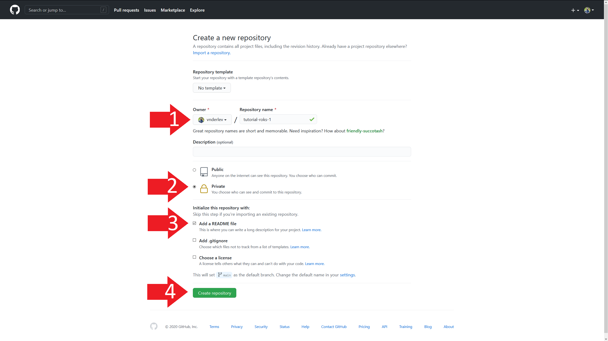
</div><br>

Después de crear el repositorio, será redirigido a la siguiente pantalla. Ahora, abra el explorador de archivos para su sistema operativo, vaya al directorio donde se guardan los archivos descargados del repositorio de tutoriales (**Dockerfile** y **pingcli-rs**), selecciónelos y arrastrelos a la pantalla de abajo. GitHub cargará los archivos a su nuevo repositorio privado automáticamente.

<div align="center" width="90%" style="border: 1px solid black;">
  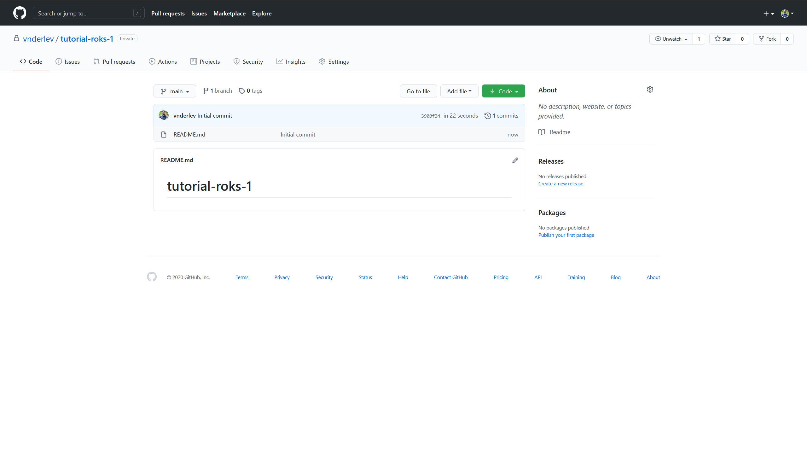
</div><br>

Después de arrastrar y soltar los archivos en la pantalla de arriba, verá lo que se muestra en la imagen siguiente. Asegúrese de que los archivos **Dockerfile** y **pingcli-rs** estén en la lista y haga clic en **Commit changes** como se indica.

<div align="center" width="90%" style="border: 1px solid black;">
  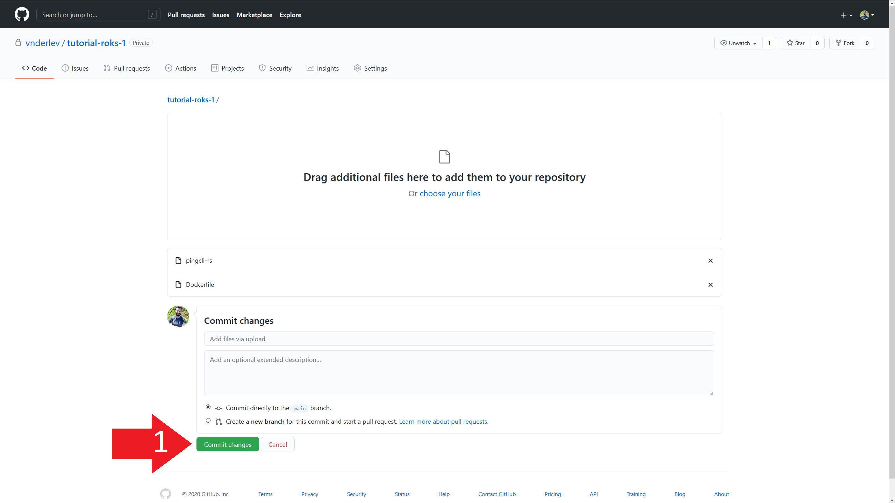
</div><br>

GitHub procesará los archivos y lo redirigirá a la pantalla de inicio de su repositorio, donde se enumerarán los nuevos archivos como se muestra en la imagen a continuación.

<div align="center" width="90%" style="border: 1px solid black;">
  
</div><br>

<hr>

#### Etapa 4 - Creando un Personal Access Token en GitHub

Acceda a la página de administración de Tokensen GitHub: https://github.com/settings/tokens (si desea navegar a la página a través de la interfaz de GitHub, haga clic en su foto de perfil en la esquina superior derecha, luego en "Settings", luego "Developer Settings", y finalmente "Personal access tokens"). Verá la siguiente pantalla. Haga clic en **"generate new token"**, como se indica.

<div align="center" width="90%" style="border: 1px solid black;">
  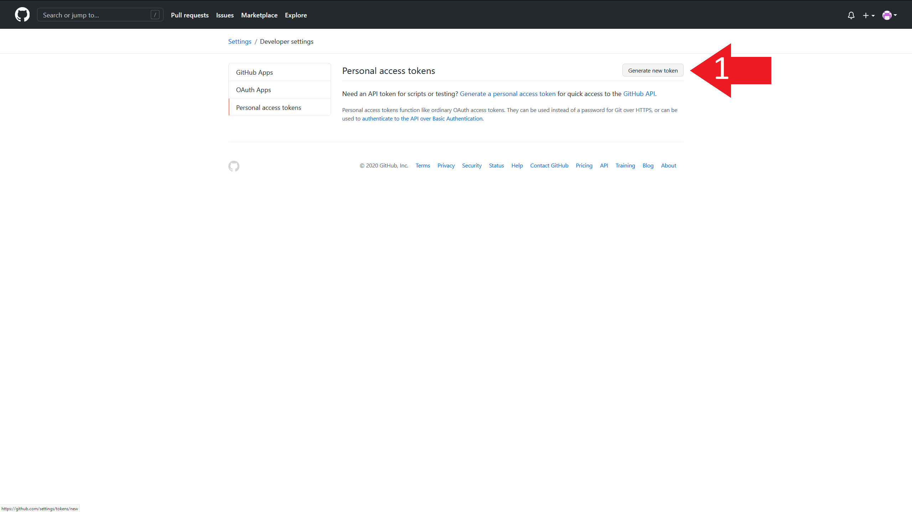
</div><br>

Nombre su token en el campo **"Note"** y seleccione la casilla de verificación **"Repo"** como se muestra en la imagen a continuación. Luego, desplácese hacia abajo hasta el final de la página y haga clic en el botón verde **"Generate token"**.

<div align="center" width="90%" style="border: 1px solid black;">
  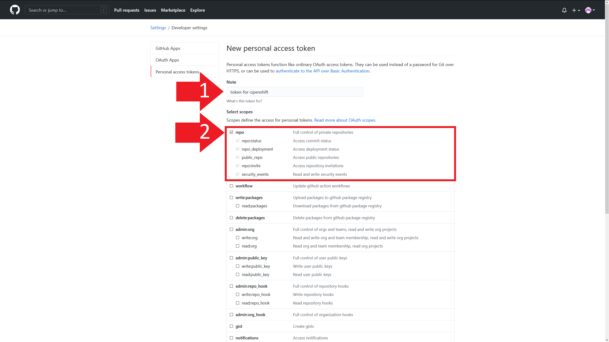
</div><br>

Después de cargar, se le dirigirá a la página que se muestra en la imagen a continuación, donde se mostrará el Token de acceso creado (como se resalta). Copie y guarde su Token en un archivo en su máquina, lo necesitará para los siguientes pasos.

<div align="center" width="90%" style="border: 1px solid black;">
  
</div><br>

<hr>

#### Etapa 5 - creando un deployment en OpenShift a partir de Dockerfile en su repositório

Vaya a la consola web de OpenShift y haga clic para acceder a la vista **Developer**, como se muestra en la siguiente imagen:

<div align="center" width="90%" style="border: 1px solid black;">
  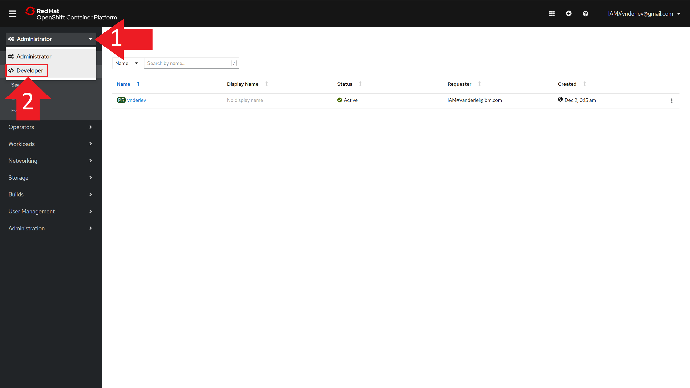
</div><br>

Luego haga clic en el nombre de su proyecto ya creado, que será similar a la dirección de correo electrónico de su cuenta de IBM Cloud, como se muestra en la imagen a continuación:

<div align="center" width="90%" style="border: 1px solid black;">
  
</div><br>

Luego haga clic en la opción **From Dockerfile**, como se muestra a continuación:

<div align="center" width="90%" style="border: 1px solid black;">
  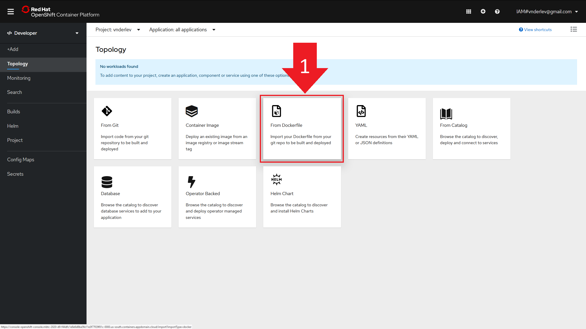
</div><br>

Se abrirá el formulario de configuración para su deployment. En el primer campo, pegue la dirección HTTP de su repositorio en GitHub, como se muestra a continuación. Aparecerá una advertencia roja que dice "**git repository is not reachable**", pero no se preocupe, esto se debe a que su repositorio es privado y OpenShift no tiene acceso a él (por eso necesitaremos el Personal Access Token desde GitHub).

<div align="center" width="90%" style="border: 1px solid black;">
  
</div><br>

Em seguida clique em "**Show advanced Git Options**", conforme indicado, e depois clique no menu dropdown "**Select Secret Name**". Finalmente, clique em "**Create New Secret**", conforme indicado abaixo:

Luego haga clic en "**Show advanced Git Options**", como se indica, y luego haga clic en el menú desplegable "**Select Secret Name**". Finalmente, haga clic en "**Create New Secret**", como se muestra a continuación:

<div align="center" width="90%" style="border: 1px solid black;">
  
</div><br>

Se abrirá el formulario para crear un **Secret** en OpenShift, y deberá completar un nombre para el Secret (caracteres alfanuméricos y guion), manteniendo seleccionada la opción "**Basic Authentication**" en la sección Authentication Type; **completa el correo electrónico de su cuenta de GitHub en el campo "Nombre de usuario"**; Pegue en el campo "**Password or Token**" su Personal Access Token generado previamente en GitHub; y finalmente haga clic en el botón "Create", como se muestra en la siguiente imagen:

<div align="center" width="90%" style="border: 1px solid black;">
  
</div><br>

Vaya al final de la página, dejando todas las demás opciones y campos como están, y haga clic en el botón "**Create**", como se muestra en la imagen a continuación:

<div align="center" width="90%" style="border: 1px solid black;">
  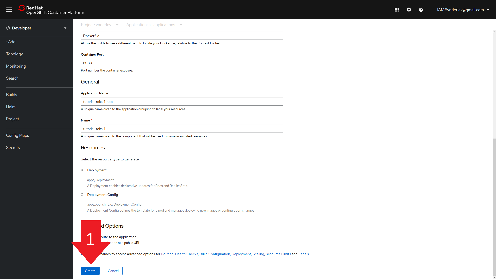
</div><br>

Después de eso, se lo dirigirá a la pantalla "**Topology**" de su deployment, que muestra un esquema de los pods y las aplicaciones integradas. En el caso del tutorial, solo tenemos un pod con una aplicación, como se muestra en la siguiente imagen:

<div align="center" width="90%" style="border: 1px solid black;">
  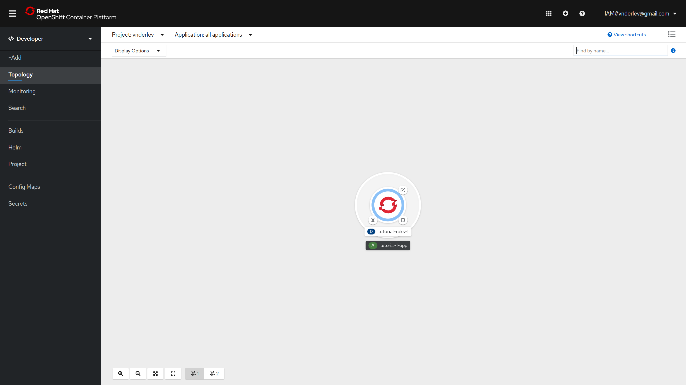
</div><br>

Haz clic en el menú desplegable en la esquina superior izquierda, donde está escrito "**</> Developer**" en la imagen de arriba y selecciona la vista "**Administrator**". Después de eso, haga clic en la sección "**Workloads**" y luego en "**Pods**". En la esquina derecha deben aparecer 2 pods, uno para el Build de Dockerfile con el estado "Completed" y otro pod que ejecuta la aplicación proporcionada con el estado "Running". Haga clic en el nombre del pod de estado "Running" (si ambos están en estado "Running", espere unos momentos).

<div align="center" width="90%" style="border: 1px solid black;">
  
</div><br>

Después de acceder a la vista detallada del Pod seleccionado, haga clic en la pestaña "**Logs**", como se muestra a continuación:

<div align="center" width="90%" style="border: 1px solid black;">
  
</div><br>

En la pestaña Logs es posible ver el resultado de las aplicaciones que se están ejecutando dentro del Pod. Tenga en cuenta que solo hay una línea, que indica un error, con el mensaje: *"invalid e-mail address informed. Check the -e argument value at the Dockerfile CMD line."*, Como se muestra a continuación:

<div align="center" width="90%" style="border: 1px solid black;">
  
</div><br>


Para corregir este error, debe realizar un cambio en el Dockerfile suministrado. Antes de hacer esto, configure el webhook para una integración completa con GitHub en la siguiente etapa.

#### Etapa 6 - Configurando un webhook para actualizar automáticamente el Deployment creado


Haga clic en el menú desplegable llamado "**Builds**" en el panel izquierdo y luego en "**Build Configs**", como se muestra a continuación:

<div align="center" width="90%" style="border: 1px solid black;">
  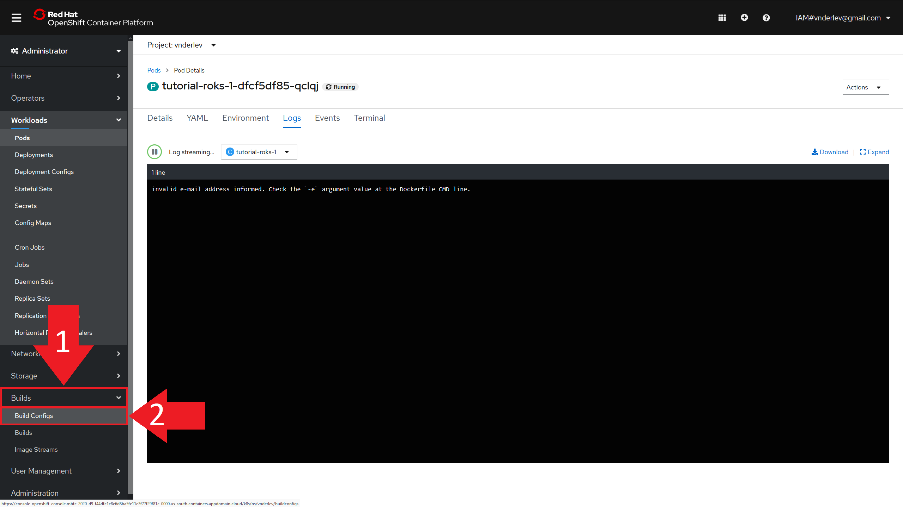
</div><br>

En la pantalla BuildConfigs, solo se creará un objeto. Haga clic en el nombre del BuildConfig disponible, como se muestra en la siguiente imagen:

<div align="center" width="90%" style="border: 1px solid black;">
  
</div><br>

Dentro de los detalles del BuildConfig seleccionado, vaya a la parte inferior de la página y haga clic en "**Copy URL with Secret**", como se destaca a continuación:

<div align="center" width="90%" style="border: 1px solid black;">
  
</div><br>

Con el Webhook copiado, ahora debemos ir al repositorio de GitHub creado para el tutorial y configurarlo. Haga clic en el botón "**Settings**" dentro del repositorio del tutorial, como se muestra a continuación:

<div align="center" width="90%" style="border: 1px solid black;">
  
</div><br>

En seguida haga clic en **Webhooks**, en el menú de la izquierda:

<div align="center" width="90%" style="border: 1px solid black;">
  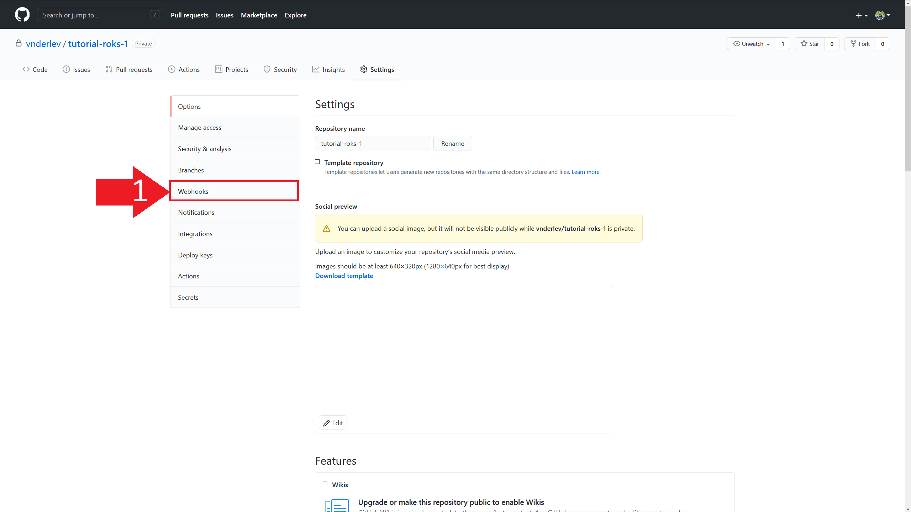
</div><br>

Luego haga clic en "**Add webhook**" en la esquina superior derecha:

<div align="center" width="90%" style="border: 1px solid black;">
  
</div><br>

En la pantalla de creación de Webhook, pegue en el campo "**Payload URL**" la dirección que se copió previamente en la pantalla de detalles de BuildConfig en OpenShift; luego seleccione el campo "**Content Type**" como "application/json"; y finalmente haga clic en "**Add webhook**" en el botón verde, siguiendo las instrucciones de la imagen a continuación:

<div align="center" width="90%" style="border: 1px solid black;">
  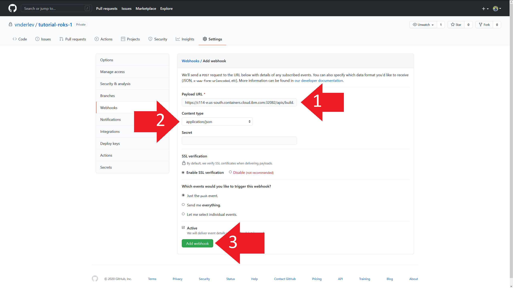
</div><br>

Después de crear el Webhook, siempre que se realice un *"push"* en este repositorio, se iniciará automáticamente una nueva compilación en su proyecto en OpenShift, reemplazando la implementación existente con la aplicación actualizada. Esta actualización se produce de forma gradual, sin provocar interrupciones.

<hr>

#### Etapa 7 - Corregir el Dockerfile y verificar los resultados

Ahora, con el Webhook configurado, podemos realizar los cambios necesarios en el Dockerfile suministrado. Abra el archivo **Dockerfile** con su editor de texto favorito, y reemplace la cadena "email@gmail.com", presente en la última línea del Dockerfile, con la dirección de correo electrónico de su cuenta de IBM Cloud (la misma informada en el formulario Desafío 9 ajustes de configuración). La siguiente figura muestra el contenido del archivo Dockerfile (se puede editar directamente en GitHub) y se selecciona la sección que debe ser reemplazada por el correo electrónico.

<div align="center" width="90%" style="border: 1px solid black;">
  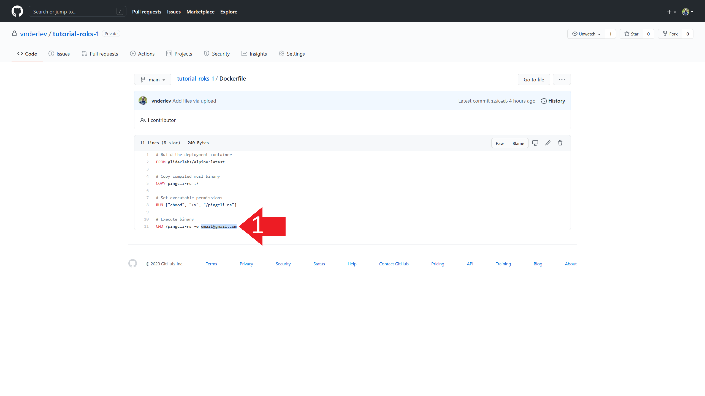
</div><br>

Si este último cambio se realiza en el archivo *Dockerfile* en su máquina, aún necesita realizar *push* de los cambios al repositorio privado que creó para el tutorial. Esto se puede hacer cargando archivos a la interfaz web de GitHub o usando la herramienta de línea de comandos *git*.

Después de realizar un cambio, el Webhook configurado detectará automáticamente la ejecución de un *push* en el repositorio y comenzará a descargar los nuevos archivos para OpenShift. OpenShift leerá el Dockerfile y creará una imagen, ejecutará un nuevo Pod con el nuevo contenedor y finalmente desconectará el Pod preexistente.

Después de realizar el *push* con el correo electrónico correcto, regrese a la consola web de OpenShift y acceda nuevamente a la pestaña **Logs** del Pod con la aplicación en ejecución. Notará que el mensaje ha cambiado de un error a un éxito, como se muestra en la siguiente imagen:

<div align="center" width="90%" style="border: 1px solid black;">
  
</div><br>

Después de ver este mensaje, habrá terminado con el tutorial.

#### Etapa 8 - Realizando la limpieza de su proyecto

En cuanto al desafío final, usarás el mismo proyecto, es una buena práctica eliminar los objetos creados en este tutorial, que ya no serán necesarios. Puede hacer esto accediendo a las siguientes pestañas en el panel izquierdo:

- **Networking > Routes**: elimine todas las Routes creadas.
- **Builds > Build Configs**: elimine todas las Build Configs creadas.
- **Builds > Image Streams**: elimine todas las Image Streams creadas.
- **Workloads > Deployments**: elimine todos los Deployments creadas.

Após apagar todos os itens listados acima, acesse **Workloads > Pods** e verifique se existem Pods em execução, todas elas devem desaparecer e seu Projeto ficar vazio.

Después de eliminar todos los elementos enumerados anteriormente, vaya a **Workloads > Pods** y verifique si hay algún Pod en ejecución, todos deberían desaparecer y su Proyecto estar vacío.

Cuando crea una nueva deployment, siguiendo el mismo esquema de este tutorial, puede reutilizar el Source Secret creado (no es necesario crear un nuevo Personal Access Token en GitHub). Sin embargo, es necesario configurar el Webhook para la actualización automática de las implementaciones, ¡recuerda esto!

<hr>

#### Más consejos de estudio:

- Objetos OpenShift y sus funciones, principalmente Deployments, Pods, Services y Routes.
- Exposición de puertos en aplicaciones Web y su relación con objetos OpenShift (es decir, cómo configurar correctamente los puertos en el código de una aplicación Web y en las propiedades de un Deployment / Route para acceder a la aplicación).
- Construcción de Dockerfiles
- API REST con protocolo HTTP, utilizando formato JSON como entrada y salida (es decir, saber implementar una API simple del tipo descrito en cualquier lenguaje de su elección).

# Recuerde: bajo ninguna circunstancia elimine su Project del clúster.
