# Esquenta Desafio 9 - Maratona Behind the Code 2020

O Desafio final da Maratona Behind the Code 2020 está chegando, e os 100 classificados entre diversos países da América Latina irão competir pelo prêmio final: uma viagem para Israel para os cinco melhores. As tecnologias e conceitos que serão aplicados no Desafio 9 são centradas em contêineres e DevOps, sobretudo OpenShift, uma alternativa Enterprise ao Kubernetes, com foco em segurança e modularidade e construído pela Red Hat. Ao final deste tutorial, você terá uma noção básica de alguns conceitos básicos da ferramenta, como: **Projects**, **Deployments**, **Services**, **Builds**, e **Routes** -- algumas dessas abstrações do OpenShift são análogas às existentes no Kubernetes!

## Tutorial de OpenShift: deployment utilizando source-to-image (s2i)

### Sobre o tutorial

Neste tutorial você irá aprender como acessar um cluster OpenShift disponível na IBM Cloud, também chamado de Red Hat *OpenShift Kubernetes Service (ROKS)*. A partir daí, será demonstrado como realizar a integração de um repositório privado do GitHub com um Project no OpenShift por meio de webhook. Esse webhook é ativado sempre que um mudança é aplicada ao branch main/master do repositório, provocando a atualização automática da sua aplicação em execução no cluster com zero-downtime, isto é, sem ser interrompida.

Este tutorial não é obrigatório, porém é altamente recomendável que você complete-o antes do dia do desafio final, para se preparar e também garantir que está conseguindo acessar normalmente o cluster disponibilizado.

### Sobre a política de uso do cluster fornecido

Devemos lembrá-lo(a) que o cluster fornecido somente poderá ser usado para o desafio. O uso indevido dessa infraestrutura poderá acarretar na sua desclassificação. É recomendável que você não deixe o projeto poluído com **Deployments** e outros objetos, pois esse será o único projeto ao qual você terá acesso, inclusive no dia do desafio -- <b>não delete ou renomeie o seu Project em hipótese alguma!</b>

### Requisitos para realizar o tutorial

1. Possuir uma conta ativa na <a href="https://cloud.ibm.com/registration">IBM Cloud</a>;

2. Ter respondido o <a href=https://challenge9.maratona.dev/>formulário de configuração para o desafio</a>. Se você não respondeu o formulário antes do dia 2 de Dezembro, seu acesso ao cluster muito provavelmente ainda não foi configurado. Por favor faça o preenchimento do formulário o mais rápido possível e comunique a organização;

3. Possuir uma conta no <a href="https://github.com">GitHub</a> (instalar a ferramenta *git* em sua máquina é opcional);

### Desenvolvimento

#### Etapa 1 - acessando o Web console do ROKS:

Faça login normalmente na sua conta da IBM Cloud (a mesma informada no formulário de configuração), e clique no seu nome no canto direito superior e selecione a conta "1960796 - IBM PoC - Maratona Behind the Code", conforme indicado na figura abaixo:

<div align="center" width="90%" style="border: 1px solid black;">
  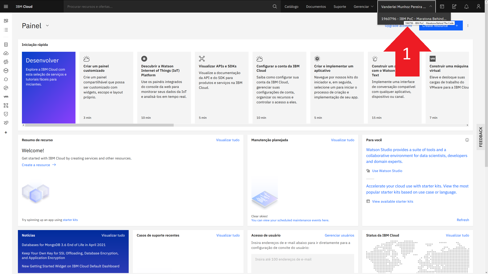
</div><br>

Após isso, acesse a <a href="https://cloud.ibm.com/resources">lista de recursos da sua conta da IBM Cloud</a>. Clique no cluster **MBTC-2020-D9**, conforme indicado na imagem abaixo:

<div align="center" width="90%" style="border: 1px solid black;">
  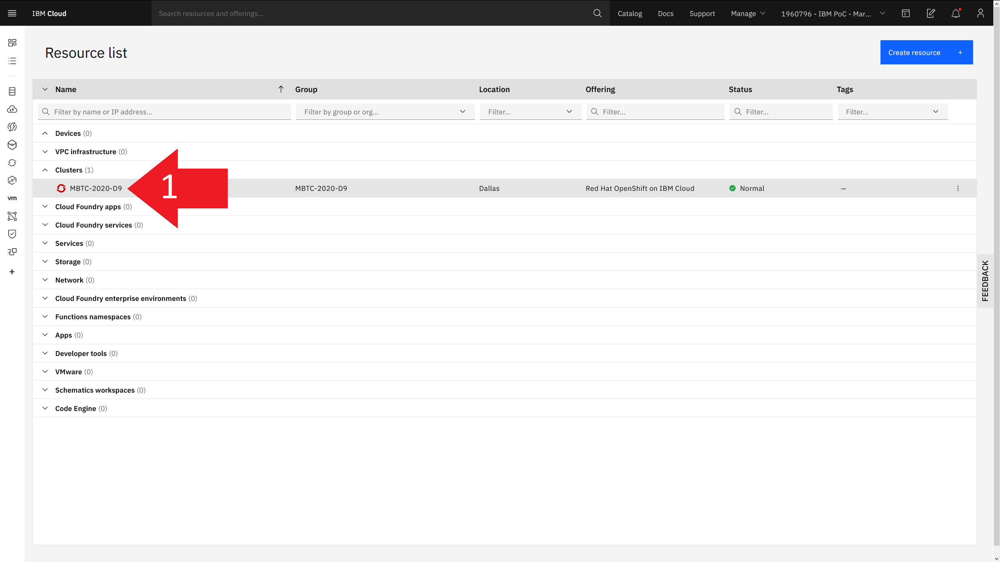
</div><br>

Após acessar a página do cluster instanciado na IBM Cloud, clique no botão azul **"OpenShift web console"**, localizado no canto direito superior da página.

<div align="center" width="90%" style="border: 1px solid black;">
  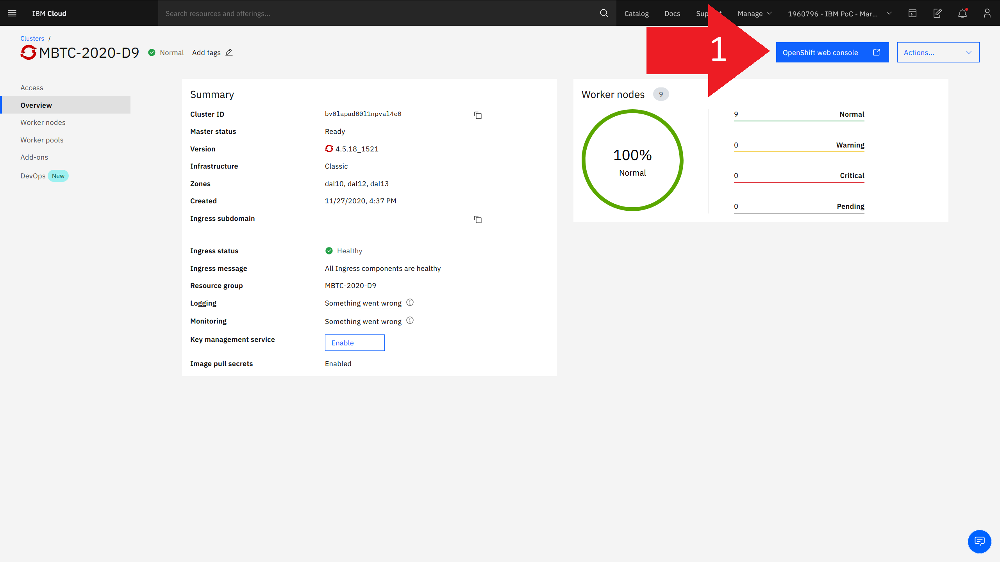
</div><br>

Aguarde o carregamento da página. É provável que seu navegador bloqueie a abertura de pop-ups. Certifique-se de dar permissões para que o Web console do OpenShift abra. Na figura abaixo é apresentada a tela "Projects" da visão de Administrador do web console do OpenShift. Através do web console é possível gerenciar e realizar o deployment de aplicações sem a necessidade de instalação da interface de linha de comando do OpenShift, também conhecida como *oc*.

<div align="center" width="90%" style="border: 1px solid black;">
  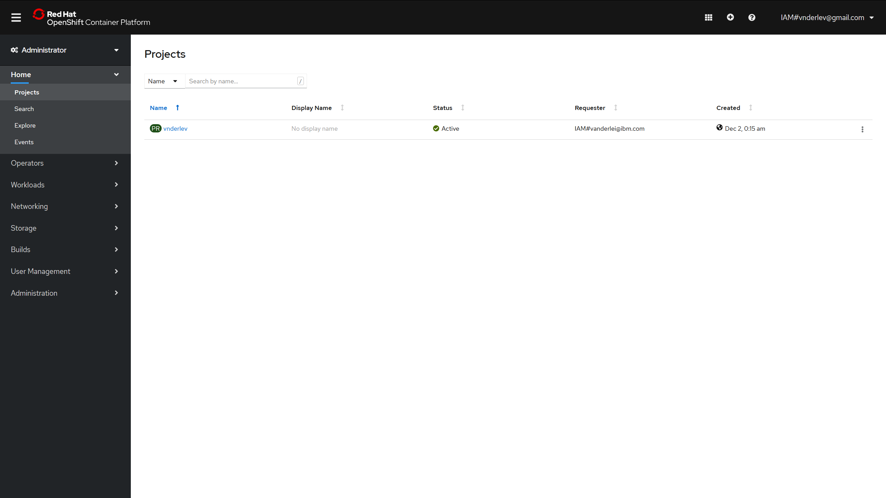
</div><br>

Você terá acesso de administrador em apenas um projeto, já criado pela organização. Na imagem acima pode-se notar que existe apenas um projeto visível, de nome "vnderlev". O nome do seu projeto será parecido com o seu endereço de e-mail da IBM Cloud, e ele **não deve ser alterado**.

Mantenha o web console do ROKS aberto e passe para a Etapa 2 do tutorial.

<hr>

#### Etapa 2 - clonando o repositório do tutorial

Caso você tenha a ferramenta *git* instalada na sua máquina, abra um terminal e execute o comando abaixo:

```git clone https://github.com/MBTC-2020-TOP100/OPENSHIFT-TUTORIAL.git```

Caso você não tenha a ferramenta *git* instalada, acesse a página do repositório no GitHub em: https://github.com/vnderlev/d9-openshift-setup-tutorial e clique no botão "Code" de cor verde e em seguida clique em "Download ZIP", conforme indicado na imagem abaixo.

<div align="center" width="90%" style="border: 1px solid black;">
  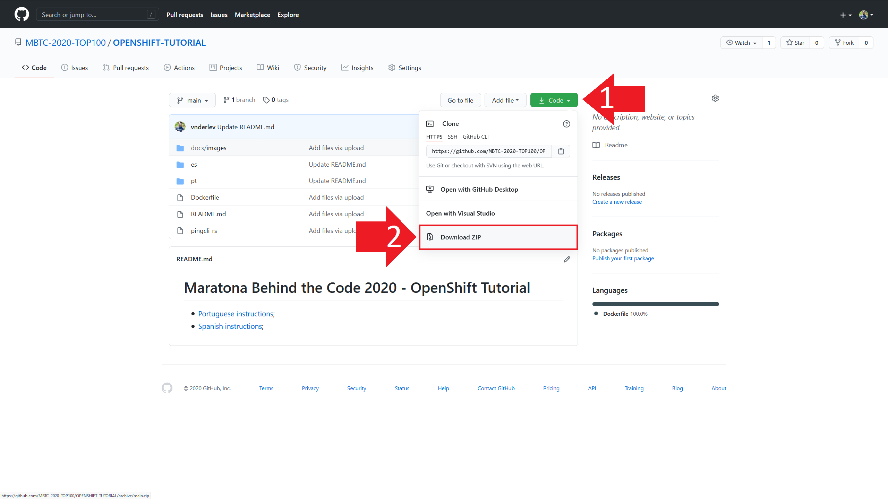
</div><br>

Após efetuado o clone do repositório, você terá em sua máquina alguns arquivos importantes, que são:

- Uma **Dockerfile** com instruções para a construção de uma imagem de contêiner;
- Um binário executável compilado com Musl-C, chamado **pingcli-rs**.

<hr>

#### Etapa 3 - criando um repositório privado no GitHub

No dia do Desafio, você precisará criar alguns repositórios no GitHub e integrá-los às funções de DevOps do OpenShift. O ideal é que seus repositórios sejam **privados**. Então, para o tutorial você deverá criar um novo repositório privado no GitHub. <a href="https://github.com/new">Clique aqui para ir à tela de criação de um novo repositório no GitHub</a>. Preencha um nome para seu repositório, selecione-o como **Privado**, marque o checkbox **"Add a README file"**, e clique em **"Create repository"**, conforme indicado na imagem abaixo:

<div align="center" width="90%" style="border: 1px solid black;">
  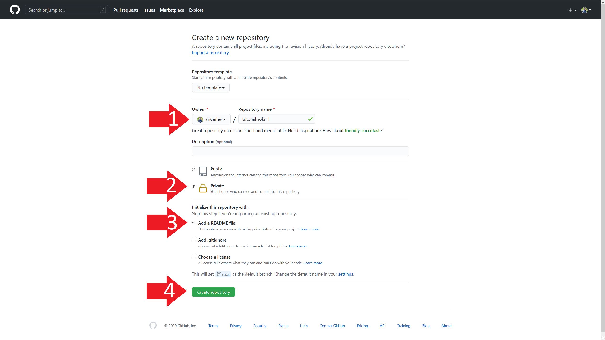
</div><br>

Após a criação do repositório, você sera redirecionado para a tela abaixo. Agora, abra o explorador de arquivos de seu sistema operacional, vá até o diretório onde estão salvos os arquivos baixados do repositório do tutorial (**Dockerfile** e **pingcli-rs**), selecione-os e arreste-os para a tela abaixo. O GitHub irá realizar o upload dos arquivos para o seu novo repositório privado automaticamente.

<div align="center" width="90%" style="border: 1px solid black;">
  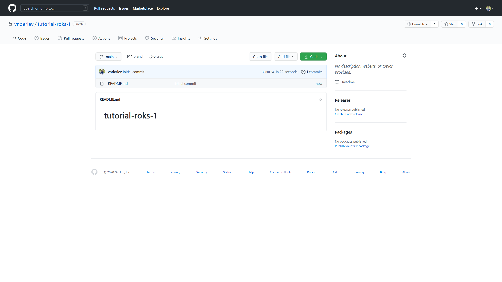
</div><br>

Após arrastar e soltar os arquivos na tela acima, você verá o que está apresentado na figura abaixo. Certifique-se de que os arquivos **Dockerfile** e **pingcli-rs** estejam listados e clique em **Commit changes** conforme indicado.

<div align="center" width="90%" style="border: 1px solid black;">
  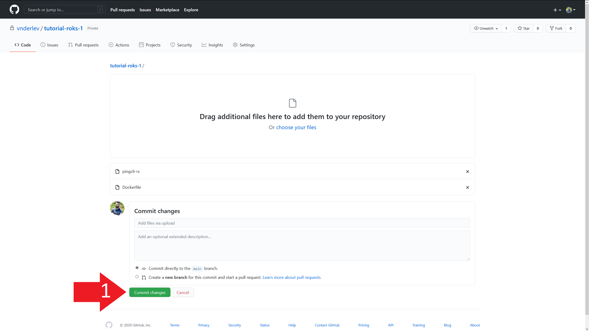
</div><br>

O GitHub irá processar os arquivos, e redirecioná-lo(a) novamente para a tela inicial do seu repositório, onde os novos arquivos estarão listados conforme a imagem abaixo.

<div align="center" width="90%" style="border: 1px solid black;">
  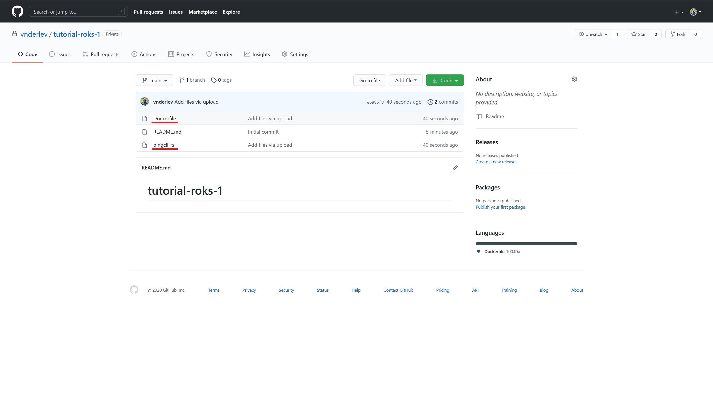
</div><br>

<hr>

#### Etapa 4 - criando um Personal Access Token no GitHub

Acesse a página de gerenciamento de Tokens do GitHub: https://github.com/settings/tokens (se desejar navegar até a página pela interface do GitHub, clique na sua foto de perfil no canto superior direito, depois em "Settings", em seguida em "Developer Settings", e finalmente em "Personal access tokens"). Você verá a tela abaixo. Clique em **"generate new token"**, conforme indicado.

<div align="center" width="90%" style="border: 1px solid black;">
  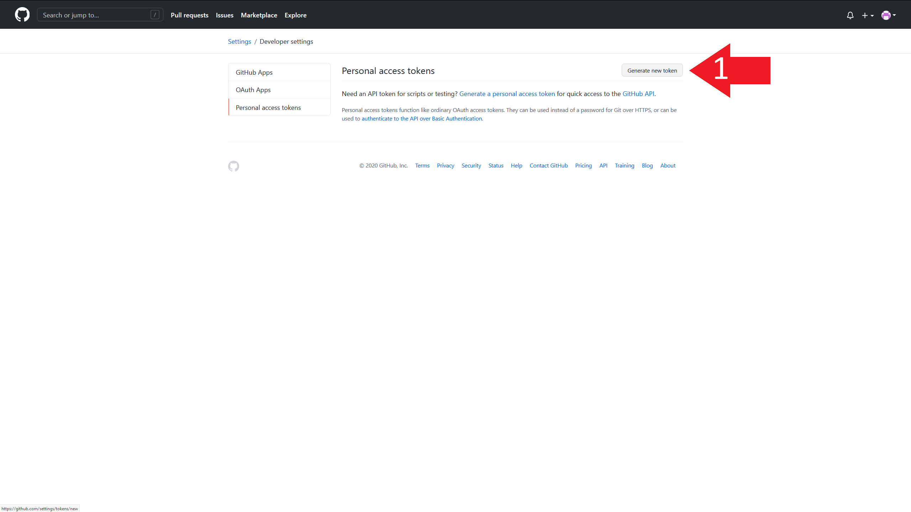
</div><br>

Dê um nome ao seu token no campo **"Note"** e selecione o checkbox **"Repo"** conforme indicado na imagem abaixo. Em seguida desça até o fim da página e clique no botão **"Generate token"** de cor verde.

<div align="center" width="90%" style="border: 1px solid black;">
  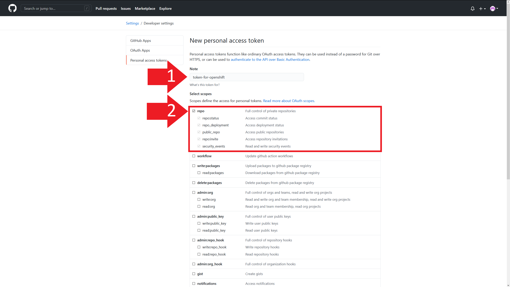
</div><br>

Após o carregamento, você será direcionado para a página apresentada na figura abaixo, na qual o Token de acesso criado será mostrado (conforme destacado). Copie e salve o seu Token em algum arquivo na sua máquina, você irá precisar dele para os próximos passos.

<div align="center" width="90%" style="border: 1px solid black;">
  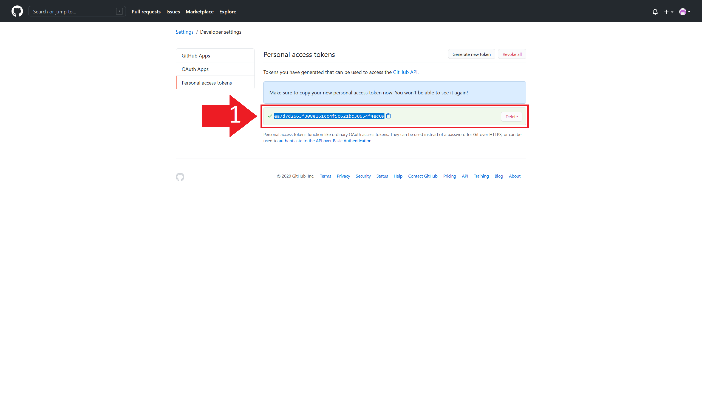
</div><br>

<hr>

#### Etapa 5 - criando um deployment no OpenShift a partir da Dockerfile em seu repositório

Vá até o web console do OpenShift e clique para acessar a visão **Developer**, conforme indicado na figura abaixo:

<div align="center" width="90%" style="border: 1px solid black;">
  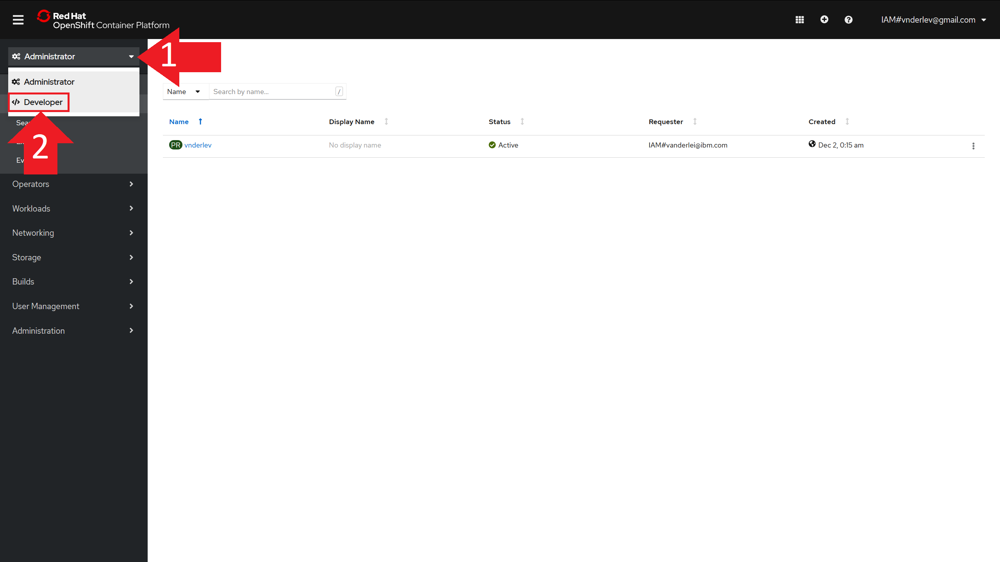
</div><br>

Clique então no nome do seu projeto já criado, que será similar ao seu endereço de e-mail da conta da IBM Cloud, conforme exemplo na imagem abaixo:

<div align="center" width="90%" style="border: 1px solid black;">
  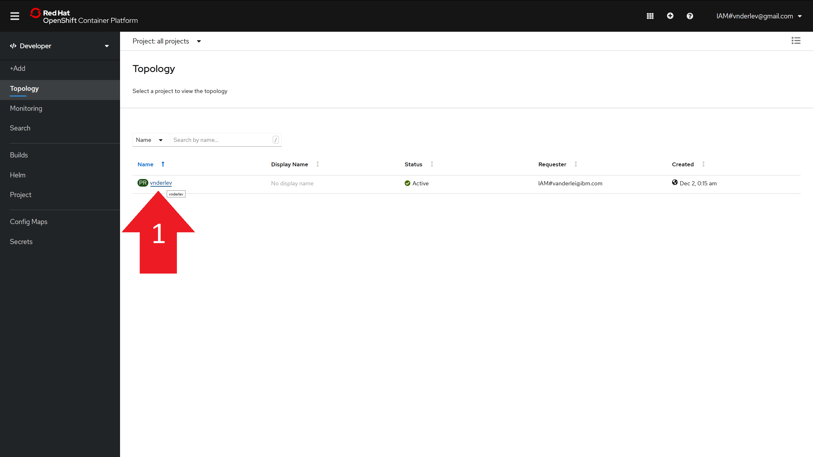
</div><br>

Em seguida, clique na opção **From Dockerfile**, conforme indicado abaixo:

<div align="center" width="90%" style="border: 1px solid black;">
  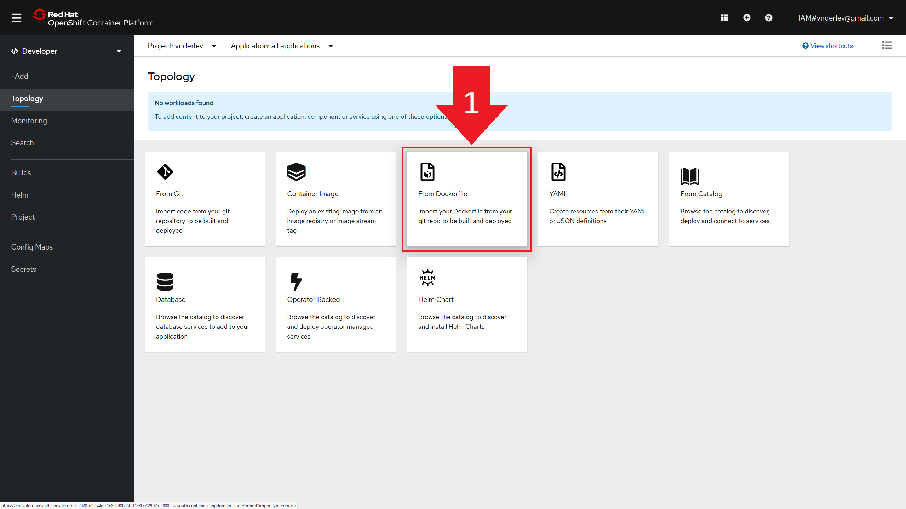
</div><br>

Será aberto o formulário de configuração do seu deployment. No primeiro campo, cole o endereço HTTP do seu repositório no GitHub, conforme indicado abaixo. Um aviso em vermelho dizendo "**git repository is not reachable**" irá aparecer, mas não se preocupe, isso ocorre pois seu repositório é privado e o OpenShift não tem acesso a ele (é por isso que iremos precisar do Personal Access Token do GitHub).

<div align="center" width="90%" style="border: 1px solid black;">
  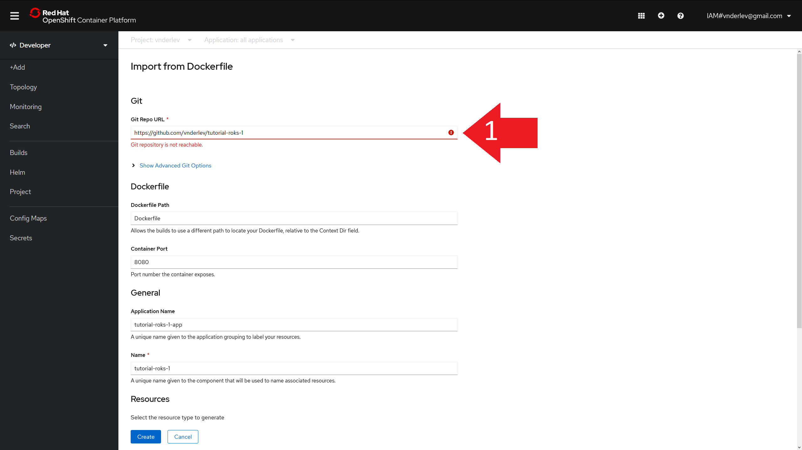
</div><br>

Em seguida clique em "**Show advanced Git Options**", conforme indicado, e depois clique no menu dropdown "**Select Secret Name**". Finalmente, clique em "**Create New Secret**", conforme indicado abaixo:

<div align="center" width="90%" style="border: 1px solid black;">
  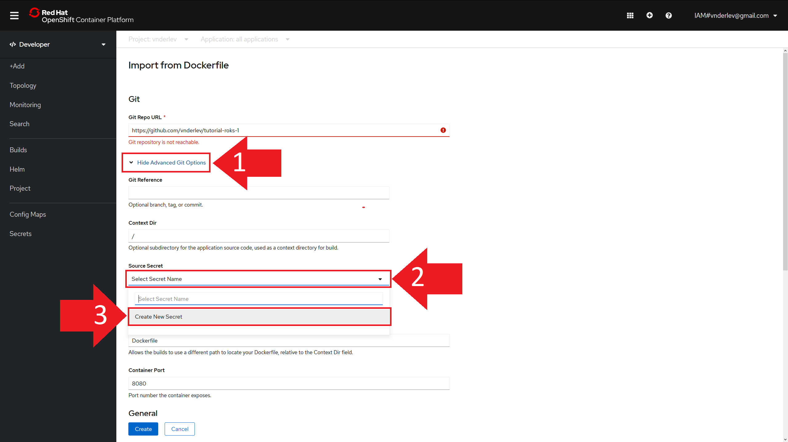
</div><br>

O formulário para a criação de um **Secret** no OpenShift abrirá, e você deverá preencher um nome para o Secret (caracteres alfanuméricos e hífen), manter selecionada a opção "**Basic Authentication**" na seção Authentication Type; **preencher o e-mail da sua conta no GitHub no campo "Username"**; Colar no campo "**Password or Token**" o seu Personal Access Token gerado anteriormente no GitHub; e finalmente clicar no botão "Create", conforme indicado na figura abaixo:

<div align="center" width="90%" style="border: 1px solid black;">
  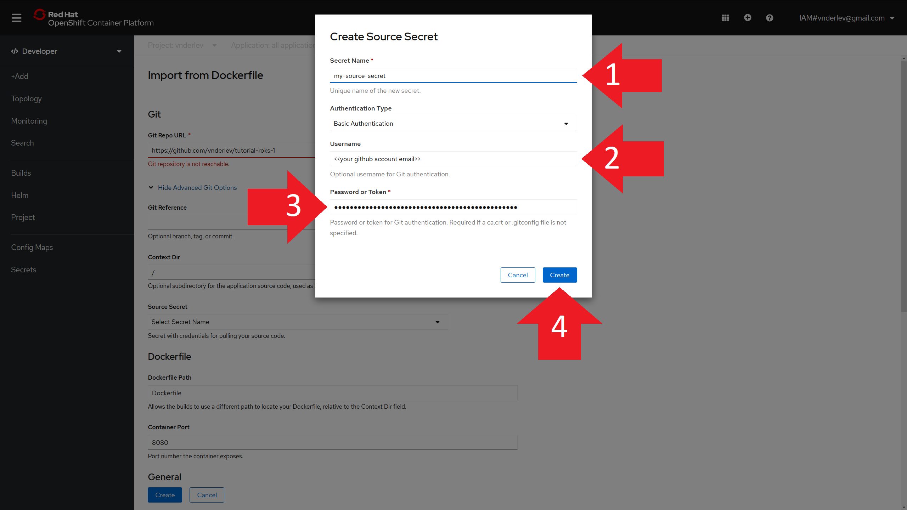
</div><br>

Vá ao final da página, deixando todas as outras opções e campos como estão, e clique no botão "**Create**", conforme indicado na imagem abaixo:

<div align="center" width="90%" style="border: 1px solid black;">
  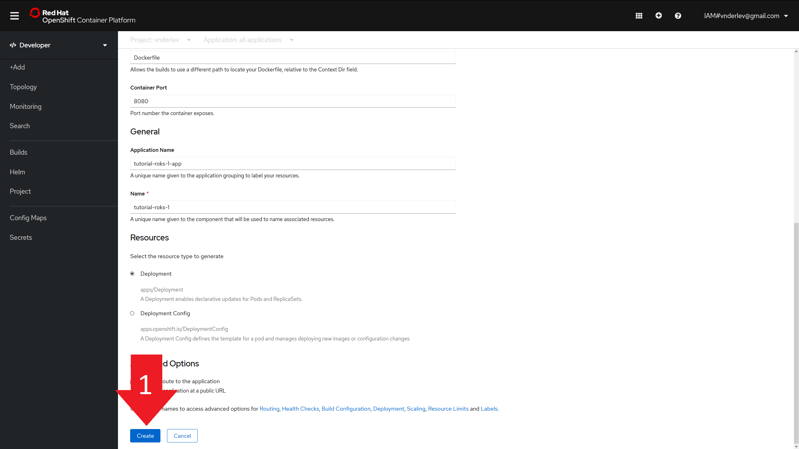
</div><br>

Após isso, você será direcionado para a tela "**Topology**" do seu deployment, que mostra um esquemático das pods e aplicações integradas. No caso do tutorial, temos apenas uma pod com uma aplicação, conforme a imagem abaixo:

<div align="center" width="90%" style="border: 1px solid black;">
  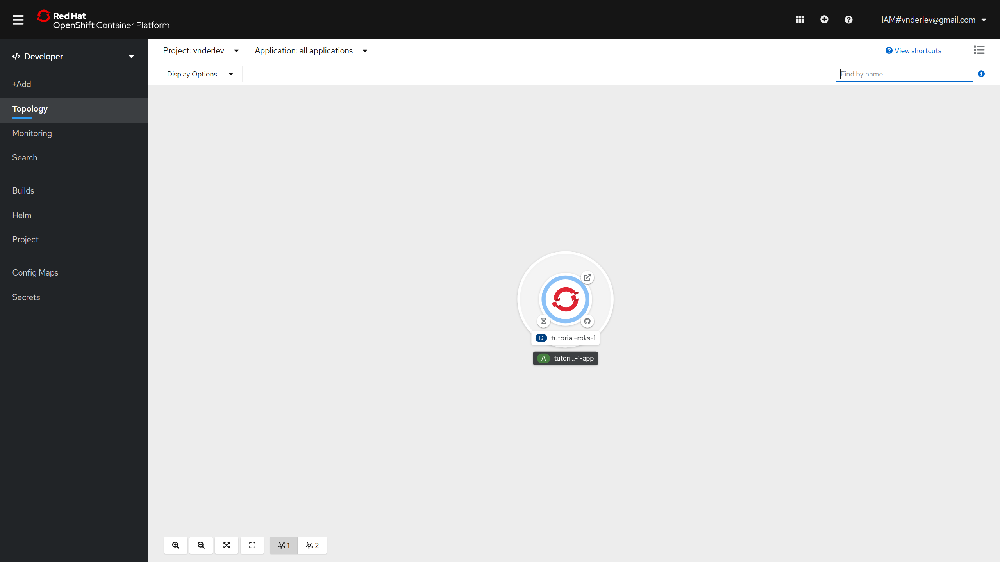
</div><br>

Clique no menu drop-down no canto esquerdo superior, onde está escrito "**</> Developer**" na imagem acima e selecione a visão "**Administrator**". Após isso, clique na seção "**Workloads**" e em seguida em "**Pods**". No canto direito deverão estar listadas 2 Pods, uma para a realização da Build da Dockerfile com status "Completed", e outra Pod executando a aplicação fornecida com o status "Running". Clique no nome da Pod de status "Running" (se as duas estiverem com status "Running", aguarde alguns instantes).

<div align="center" width="90%" style="border: 1px solid black;">
  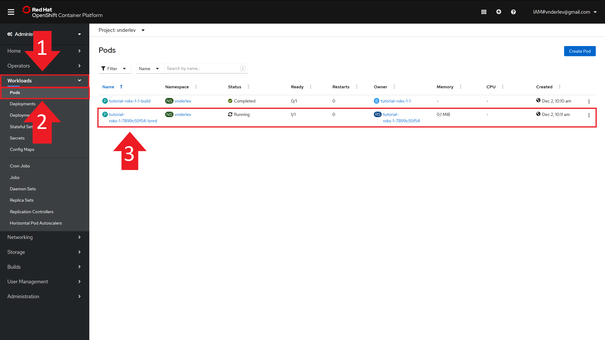
</div><br>

Após acessar a visão detalhada da Pod selecionada, clique na Aba "**Logs**", conforme indicado abaixo:

<div align="center" width="90%" style="border: 1px solid black;">
  
</div><br>

Na aba Logs é possível ver a saída das aplicações que estão sendo executadas dentro da Pod. Note que existe apenas uma linha, indicando um erro, com a mensagem: *"invalid e-mail address informed. Check the -e argument value at the Dockerfile CMD line."*, conforme apresentado abaixo:

<div align="center" width="90%" style="border: 1px solid black;">
  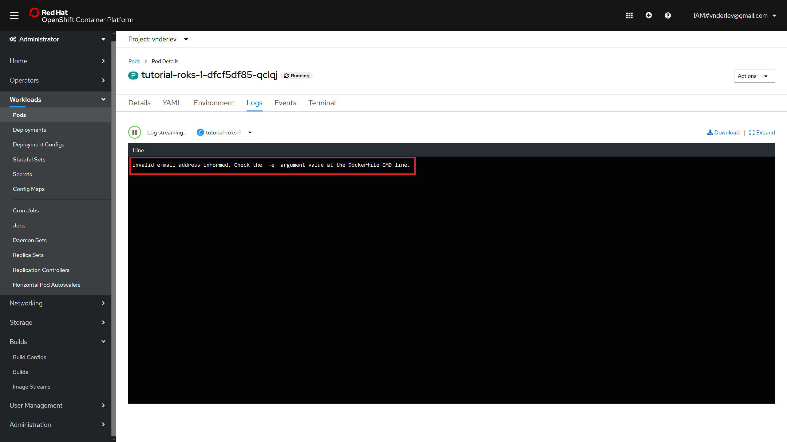
</div><br>

Para corrigir esse erro precisamos realizar uma alteração na Dockerfile fornecida. Antes de fazer isso, vamos configurar o webhook para integração completa com o GitHub na próxima etapa.

#### Etapa 6 - Configurando um webhook para atualização automática do Deployment criado

Clique no menu drop-down chamado "**Builds**" no painel esquerdo, e em seguida em "**Build Configs**", conforme indicado abaixo:

<div align="center" width="90%" style="border: 1px solid black;">
  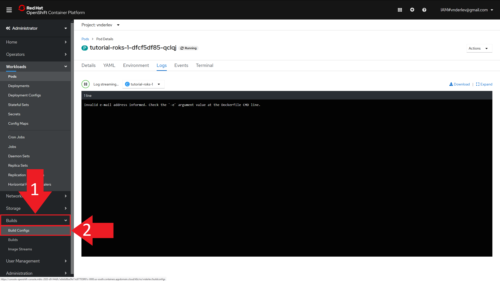
</div><br>

Na tela das BuildConfigs, existirá apenas um objeto criado. Clique no nome da BuildConfig disponível, conforme indicado na imagem a seguir:

<div align="center" width="90%" style="border: 1px solid black;">
  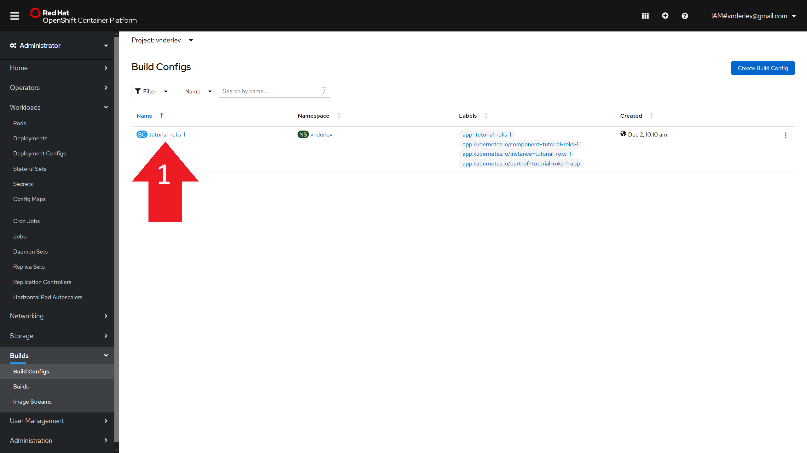
</div><br>

Dentro dos detalhes da BuildConfig selecionada, vá ao fim da página e clique em "**Copy URL with Secret**", conforme destacado abaixo:

<div align="center" width="90%" style="border: 1px solid black;">
  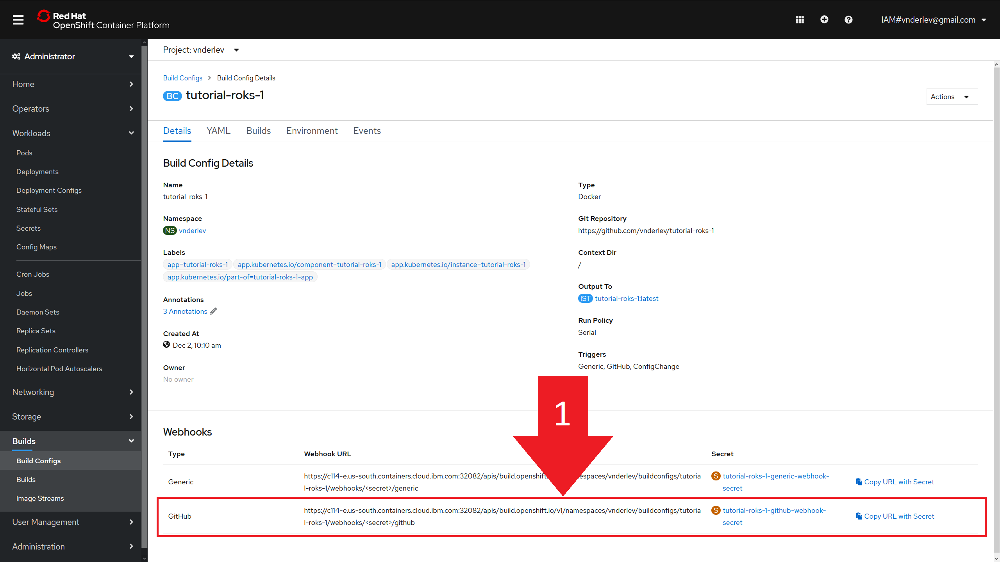
</div><br>

Com o Webhook copiado, precisamos agora ir ao repositório do GitHub criado para o tutorial, e configurá-lo. Clique no botão "**Settings**" dentro do repositório do tutorial, conforme apresentado abaixo:

<div align="center" width="90%" style="border: 1px solid black;">
  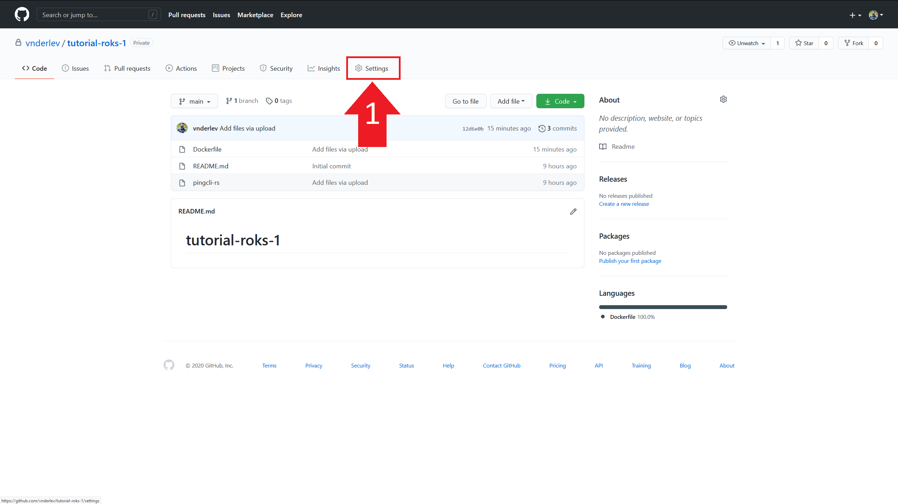
</div><br>

Em seguida clique em **Webhooks**, no menu à esquerda:

<div align="center" width="90%" style="border: 1px solid black;">
  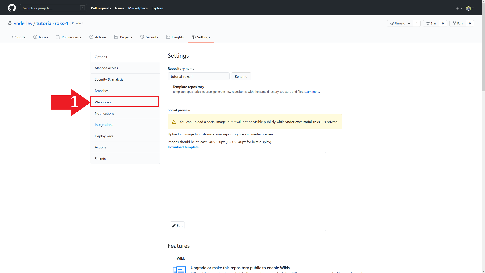
</div><br>

Em seguida clique em "**Add webhook**", no canto direito superior:

<div align="center" width="90%" style="border: 1px solid black;">
  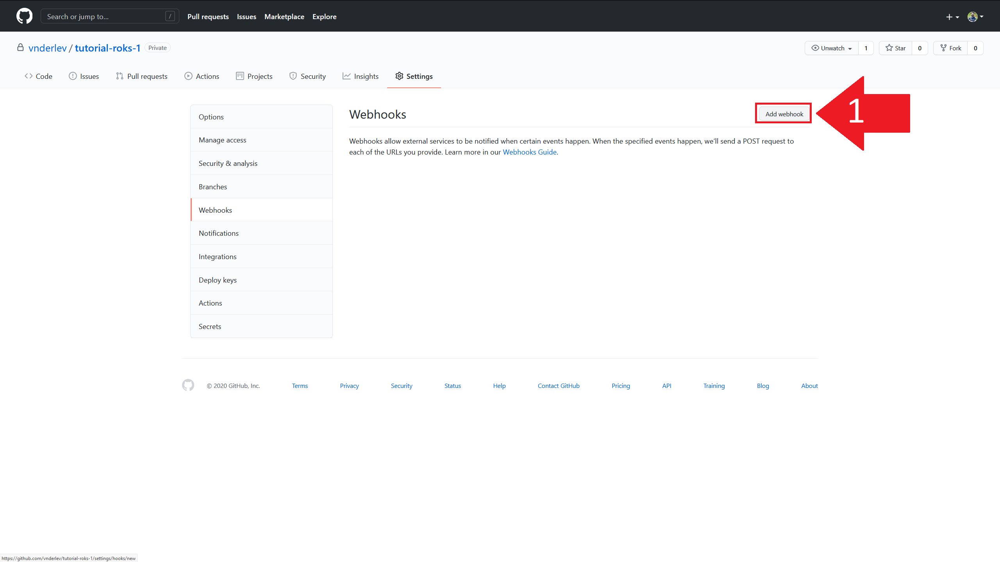
</div><br>

Na tela de criação do Webhook, cole no campo "**Payload URL**" o endereço que foi copiado anteriormente na tela de detalhes da BuildConfig no OpenShift; em seguida selecione o campo "**Content Type**" como "application/json"; e finalmente clique em "**Add webhook**" no botão verde, seguindo as instruções na imagem abaixo:

<div align="center" width="90%" style="border: 1px solid black;">
  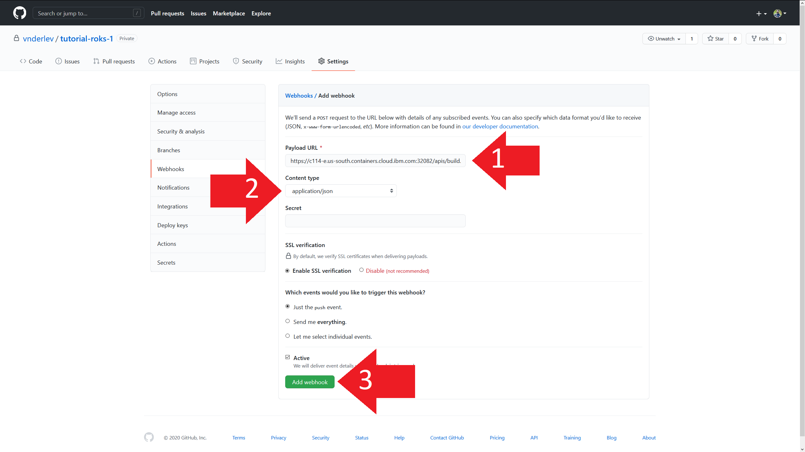
</div><br>

Após a criação do Webhook, toda vez que um *"push"* for realizado neste repositório, uma nova Build será automaticamente inicializada no seu projeto no OpenShift, substituindo o deployment existente pela aplicação atualizada. Esse update ocorre de maneira gradual, sem causar interrupções.

<hr>

#### Etapa 7 - Corrigindo a Dockerfile e verificando os resultados

Agora com o Webhook configurado, podemos realizar as alterações necessárias na Dockerfile fornecida. Abra o arquivo **Dockerfile** com seu editor de texto favorito, e substitua a string "email@gmail.com", presente na última linha da Dockerfile, pelo e-mail da sua conta da IBM Cloud (a mesma informada no formulário de configuração do Desafio 9). A figura abaixo mostra o conteúdo do arquivo Dockerfile (pode ser editado diretamente no GitHub), e o trecho que deve ser substituído pelo e-mail está selecionado.

<div align="center" width="90%" style="border: 1px solid black;">
  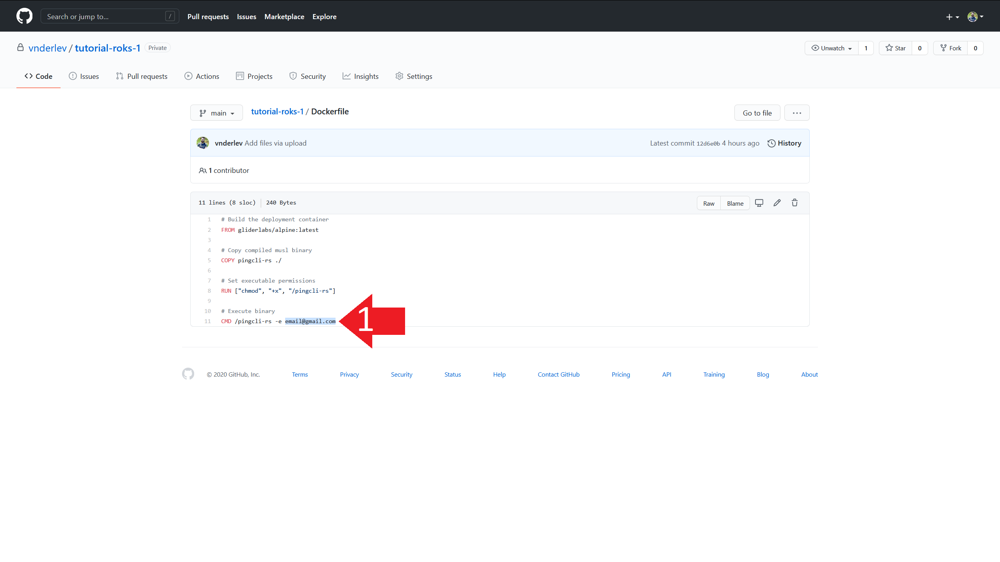
</div><br>

Caso essa última alteração seja feita no arquivo *Dockerfile* que está na sua máquina, você ainda precisa realizar o *push* das alterações para o repositório privado que você criou para a realização do tutorial. Isso pode ser feito via upload de arquivos na interface web do GitHub ou utilizando a ferramenta de linha de comando *git*.

Após a realização de uma mudança, o Webhook configurado irá automaticamente detectar a execução de um *push* no repositório, e iniciar o download dos novos arquivos para o OpenShift. O OpenShift irá então ler a Dockerfile, e construir uma imagem, rodar uma nova Pod com o novo contêiner e por fim desligar a Pod pré-existente.

Após realizar o *push* com o e-mail correto, retorne ao web console do OpenShift e acesse novamente a aba **Logs** da Pod com a aplicação em execução. Você notará que a mensagem terá alterado de um erro para um sucesso, conforme na imagem abaixo:

<div align="center" width="90%" style="border: 1px solid black;">
  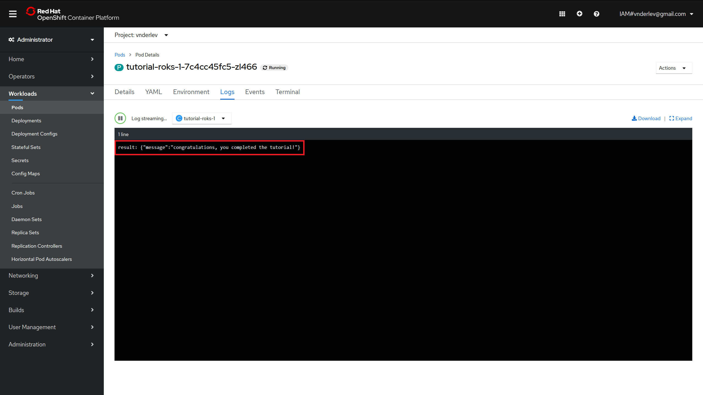
</div><br>

Após visualizar essa mensagem, você terá concluído o tutorial.

#### Etapa 8 - Realizando a limpeza no seu projeto

Como para o desafio final vocês usarão o mesmo projeto, é uma boa prática apagar os objetos criados neste tutorial, que não serão mais necessários. Você pode fazer isso acessando as seguintes abas no painel à esquerda: 

- **Networking > Routes**: apague todas as Routes criadas;
- **Builds > Build Configs**: apague todas as Build Configs criadas;
- **Builds > Image Streams**: apague todas as Image Streams criadas;
- **Workloads > Deployments**: apague todos os Deployments criados.

Após apagar todos os itens listados acima, acesse **Workloads > Pods** e verifique se existem Pods em execução, todas elas devem desaparecer e seu Projeto ficar vazio.

Quando você for criar um novo deployment, seguindo o  mesmo esquema desse tutorial, você poderá re-aproveitar o Source Secret criado (não é necessário criar um novo Personal Access Token no GitHub). Porém, é necessária a configuração do Webhook para atualização automática dos deployments, lembre-se disso!

<hr>

#### Mais dicas de estudo:

- Objetos do OpenShift e suas funções, principalmente os Deployments, Pods, Services, e Routes.
- Exposição de portas em aplicações Web e a relação disso com os objetos do OpenShift (em outras palavras, como configurar as portas corretamente no código de uma aplicação Web e nas propriedades de um Deployment/Route para acesso à aplicação).
- Construção de Dockerfiles
- APIs REST com protocolo HTTP, usando formato JSON como entrada e saída (em outras palavras, saber como implementar uma API simples do tipo descrito em alguma linguagem de sua escolha).

# Lembrando: em hipótese alguma apague o seu Project do cluster.
